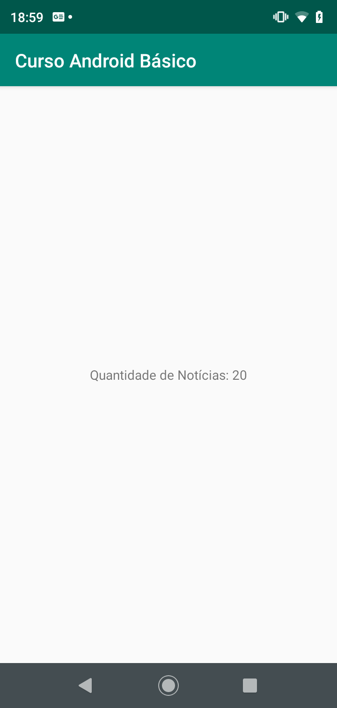
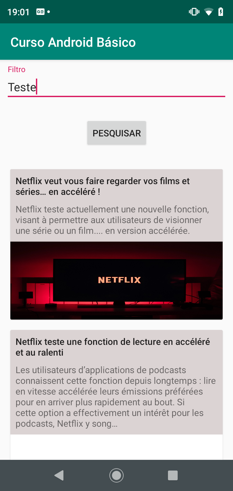

## Curso Android Básico - Corujão Tecnológico IFTM Paracatu

**Dia:** 08/11/2019

### Slides

[Minicurso Android Básico (IFTM Campus Paracatu)](https://docs.google.com/presentation/d/14xzrk8h6DRHlHUrD8pn4b2hVBs4vDY6c_NcNj-Z6z4U/edit?usp=sharing)

### Versão Inicial

O curso será iniciado pelo projeto disponível na pasta [versao1](https://github.com/viniciusalvesmello/curso_android_basico_iftm_paracatu/tree/master/versao1), sendo que o mesmo já inclui toda a estrutura para consumir a api do site [News](https://newsapi.org/).

##### A versão inicial utiliza as seguintes bibliotecas:

- [Android X](https://developer.android.com/jetpack/androidx)
- [Material Design](https://material.io/develop/android/)
- [Dagger 2](https://dagger.dev/android)
- [RxJava](https://github.com/ReactiveX/RxJava)
- [RxAndroid](https://github.com/ReactiveX/RxAndroid)
- [Retrofit](https://square.github.io/retrofit/)
- [OkHttp](https://square.github.io/okhttp/)
- [Gson](https://github.com/google/gson)
- [Picasso](https://square.github.io/picasso/)

##### A versão inicial utiliza também os padrões de projeto:

- [MVVM](https://developer.android.com/topic/libraries/architecture/viewmodel)
- [Clean Architecture](https://medium.com/android-dev-br/clean-architecture-para-android-eb492513263e).

##### Aparência da versão Inicial

---

### Versão Final

Durante o curso será desenvolvido apenas as diferenças entre a versão inicial e a final. A versão final esta diponível na pasta [versao2](https://github.com/viniciusalvesmello/curso_android_basico_iftm_paracatu/tree/master/versao2).

Durante o desenvolvimento da versão final vamos apreender a criar uma consulta que executa uma chamada a [View Model](https://developer.android.com/topic/libraries/architecture/viewmodel) e preenche os dados da [RecyclerView](https://developer.android.com/guide/topics/ui/layout/recyclerview).

Para criar esta estrutura vamos apreender um pouco de como criar [Layouts no Android](https://developer.android.com/guide/topics/ui).

##### Aparência da versão final

